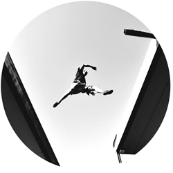
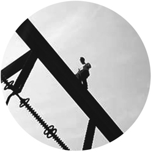

This blog explores the topics of skill acquisition and movement education. It is targeted to coaches, teachers, practitioners and sport science students.

The blog co-creators were brought together by a common background in both sport sciences and parkour.

[Yann Daout](https://adaptivemovement.blog/author/yann-daout/) has a Master in Sport and social sciences from the University of Lausanne, Switzerland. He has been training parkour since 2011. He writes so he can stop thinking all that stuff.

[Ville Laine](https://adaptivemovement.blog/author/ville-laine/) has a Master in Sport pedagogy from Jyväskylä University, Finland. Ville has been training parkour for 12 years, and is now an entrepreneur interested in the gamification of skill acquisition. He likes to read books and cereal box labels.

[Pawel van der Steen](/author/pawel-van-der-steen) has a Bachelor in Human movement sciences and Master of Sport sciences from the University of Groningen in The Netherlands. He has been training parkour since 2005, and apart from training he likes to complain about how parkour used to be better back then.

Unless stated otherwise, all our content is released under a [CC BY-SA 3.0 license](https://creativecommons.org/licenses/by-sa/3.0/deed.en). You may share and modify our articles, as long as you credit us !
